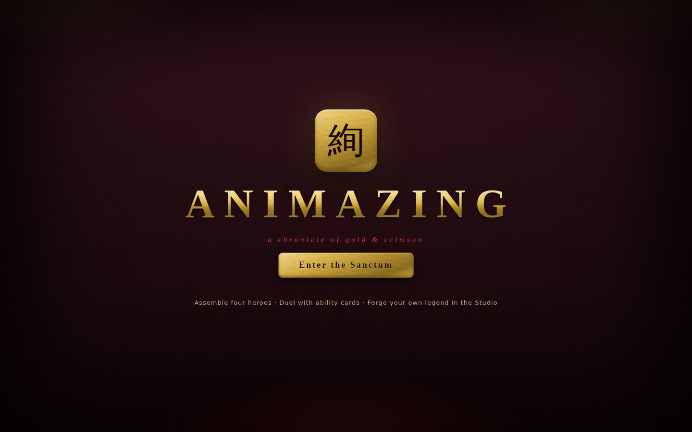
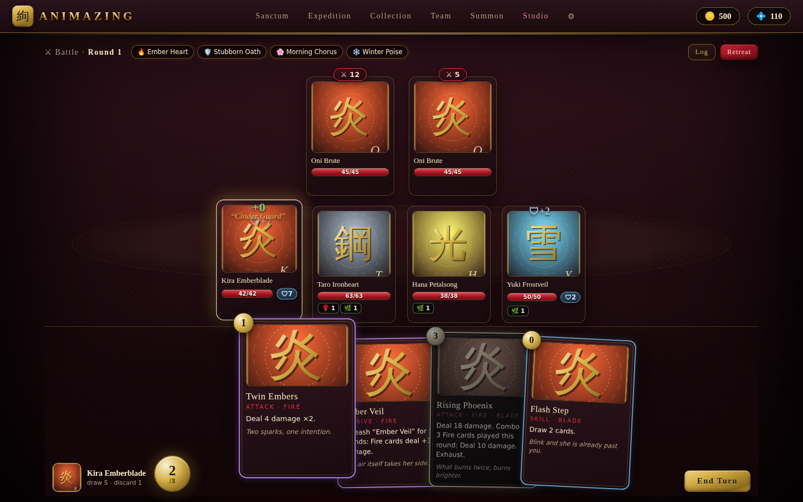
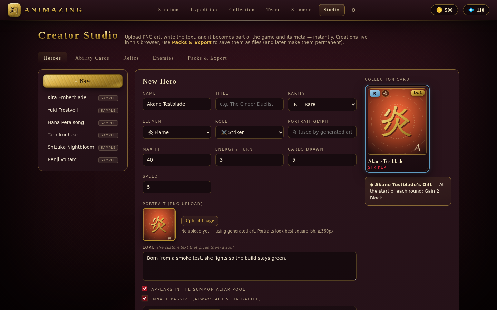

# 絢 ANIMAZING

A **Slay-the-Spire-inspired team card battler** in brushed gold and crimson — built to be *yours*. Collect anime-style heroes of varying rarity, build a team of four, duel through expedition gauntlets with synergizing ability cards, relics and battlefield passives… and then open the **Creator Studio** and replace the entire cast with characters you drew and wrote yourself.



## Play it

No build step, no dependencies. From the repo root:

```bash
cd animazing
python3 -m http.server 8123     # or: npx serve
# open http://localhost:8123
```

Opening `index.html` directly from disk (`file://`) also works in Chromium-based browsers and Firefox.

### Single-file build

For sharing — one HTML file you can email, drop on any static host, or open by double-clicking, with the stylesheet and all scripts inlined:

```bash
node tools/build-single.js                 # → dist/animazing.html (~310 KB)
node tools/build-single.js --fragment out.html --title "Animazing"
```

The build reads its script list from `index.html`, so content packs you add there are included automatically. `--fragment` omits the `<html>/<head>/<body>` shell for hosts that supply their own (embedded viewers, artifact frames).

The game degrades gracefully where a host restricts browser APIs: with storage blocked it runs fully in memory and says so; where a page can't hand over a file, pack export falls back to the host's save API and then to copy-out text, and **Paste pack text** imports without a file picker.

> Progress (collection, currencies, expeditions) and Studio content (heroes, cards, uploaded PNG art) are saved **in the browser** — localStorage for data, IndexedDB for images. Use **Settings → Export full save** and **Studio → Packs & Export** for file backups.

## The game



- **Team of four, turns your way.** Each round every hero acts once — but *you* choose the order, every round. Draw five, spend energy, play cards, pass the spotlight.
- **Telegraphed enemies.** Every foe shows its intent (⚔ damage numbers, 🛡 defending, ↑ buffs, ↓ hexes, 🎲 chaos). Plan your four turns around what's coming.
- **Synergy is the game.** Cards carry tags (Fire, Blade, Storm, Venom…). Combos trigger off tags played this round; scaling cards count them. Battlefield **passives** persist for rounds and hook into everything (round starts, cards played, damage math). **Relics** equipped on heroes add always-on hooks. Innate hero passives round it out — and everything stacks.
- **Statuses with teeth.** Strength, Vulnerable, Weak, Poison, Burn, Regen, Thorns, Evade, Taunt, Stun, Aegis, Fortify.
- **Expeditions.** Eight-node runs — battles, elites, forges, weird events, and a boss. Team HP persists; the fallen crawl back at 25%. Victory pays gold, crystals, and a pick-1-of-3 card reward. Clearing a boss unlocks the next difficulty tier.
- **Summon Altar.** Hero summons (with a 10-pull SR-or-better pity), ability packs, relic caches. Duplicate heroes ascend (+1 level, +4 max HP).

## The Creator Studio — your content, instantly part of the game



This is the heart of Animazing. The Studio is the upload bay for **your PNG art and custom text**:

- **Heroes** — name, title, rarity (N/R/SR/SSR/UR), element, role, stats, lore, portrait PNG, optional innate passive.
- **Ability cards** — owner, cost, type, tags, flavor text, and a visual **effect builder** (damage, block, heal, statuses, energy, draw, revive, cleanse, battlefield passives, chaos rolls — with combo conditions and scaling amounts). The card preview is exactly what renders in game.
- **Relics** — stat mods, gold bonuses, and battle hooks.
- **Enemies** — stats, elite/boss flags, and full movesets with intents.

Saved content joins the live game immediately: your heroes appear in the collection and summon pool, your cards drop from packs and battle rewards, your enemies join the expedition pool. Uploads are downscaled and stored locally; entities without art get procedurally generated gold-kanji sigils.

**Make it permanent:** *Studio → Packs & Export* bundles everything (images included) into a single `.json` pack — or a `.js` pack that auto-loads for every player once dropped into [`packs/`](packs/README.md) and referenced from `index.html`. Sample content can be hidden in Settings once your own cast can stand alone.

## Project layout

```
animazing/
├── index.html               single page, plain <script> loading — no bundler
├── css/animazing.css        the brushed-gold & crimson skin
├── js/
│   ├── core/                util (seeded RNG, helpers), storage (saves, IndexedDB media, packs)
│   ├── data/                schema + effect DSL metadata + auto card-text; starter sample content
│   ├── game/                effects interpreter, battle engine (DOM-free), content registry, meta state
│   └── ui/                  screen renderers: hub/collection/team/summon/settings, battle+expedition, studio
├── packs/                   file-based content packs (see packs/README.md)
├── tools/build-single.js    inlines everything into one shareable .html
├── docs/DESIGN.md           mechanics + full effect-DSL reference + architecture + extension points
├── docs/ROADMAP.md          where the story mode and deeper progression will plug in
└── tests/engine-test.js     headless engine suite — run: node tests/engine-test.js
```

The battle engine and all game logic are DOM-free and deterministic under a seed — the same modules run headless in Node for the test suite (72 checks: damage math, statuses, combos, passive hooks, gacha pity, run generation, pack round-trips).

## Where this goes next

The design leaves explicit room for a story campaign, character ascension trees, crafting and more — see [docs/ROADMAP.md](docs/ROADMAP.md). Content is schema-versioned, the effect DSL is data-driven, and screens are modular, so the meta can deepen without rewrites.
