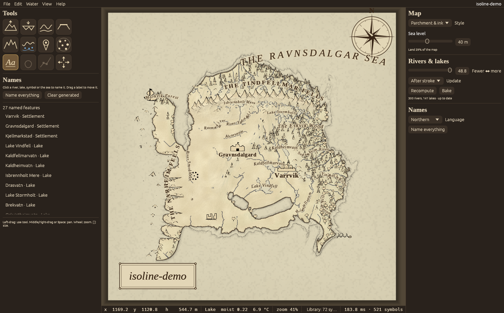
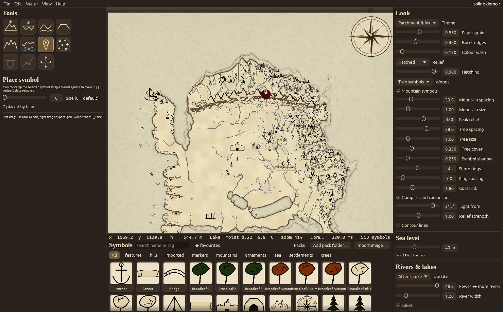
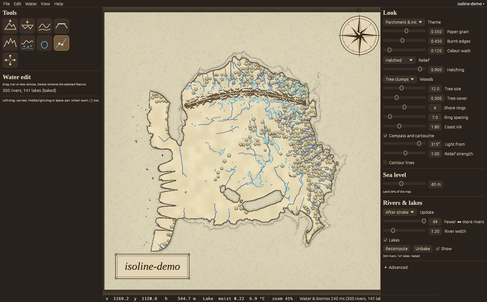
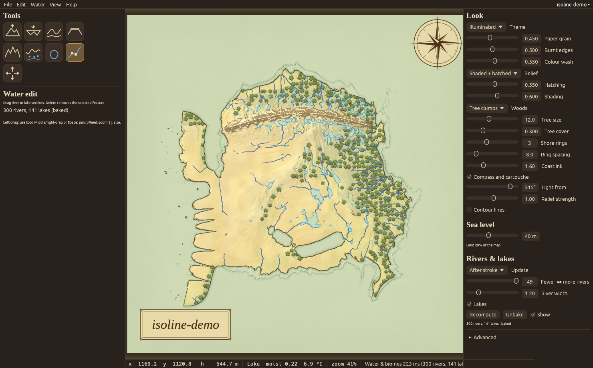
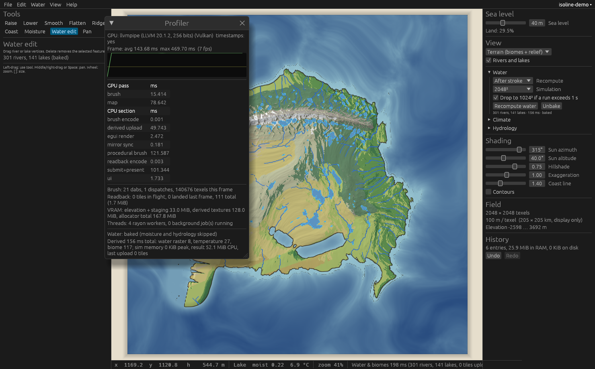

# Isoline

A desktop fantasy map maker where **nothing is tile-based**. Terrain is a set
of continuous scalar fields plus vector geometry, edited by brushes that modify
the underlying data; everything visible (hillshade, the coastline, later rivers,
climate, biomes, forests, settlements) is *derived* from those fields, live.

The coastline is literally the isoline `elevation == seaLevel`, hence the name.



## Symbol and usability pass (after Milestone 5)

Feedback: the mountain symbols looked copy-pasted, there were artifacts in
the range and among the trees, and the program was far too configurable.

- **Mountain symbols redrawn** (`tools/gen_default_pack.py`): ten peak
  shapes plus four foothills, one- or two-summit silhouettes, a shadow
  ridge with slope hatching clipped to the body, and a fill that fades to
  transparent toward the base so a row of peaks never forms a flat-bottomed
  band. Summits are drawn in pieces so smoothing cannot round them into
  loops. `cargo run -p isoline-core --example contact_sheet -- assets/packs/default out.png`
  renders a pack for checking.
- **Placement**: peaks vary in size well beyond their height, jitter off the
  crest, and each main peak may spawn one or two smaller companions a little
  downhill, so ranges read as massifs two or three deep rather than a single
  file of summits. Hills are skipped inside woods; trees avoid peaks.
- **Artifacts**: shader hatching is gated by slope, fades out above 1.2×
  zoom (symbols carry the relief there), and is lighter by default; the
  symbol drop shadow is halved.
- **UI cut down**: the right panel is now Style (one choice of three),
  Sea level, Rivers & lakes (fewer ↔ more, update mode, Recompute, Bake) and
  Names (language, Name everything). Every appearance slider is gone: paper
  grain, burnt edges, colour wash, relief mode, hatching, shading, woods
  style, tree and peak sliders, shore rings, coast ink, ornaments, labels,
  typography, light direction, relief strength and contours. Each tool
  shows two or three controls with the rest behind a collapsed *More…*.
  Climate, hydrology, the biome matrix, data views, contour lines,
  automatic-symbol tuning and project statistics live in View → Advanced
  settings.

## Status: Milestone 5 — naming and labels

- **Entities** (`isoline-core::entity`): id, kind (settlement, river, lake,
  range, peak, forest, bay, cape, strait, sea, region, road, marker,
  title), name, tags, notes, importance, style overrides, culture, and a
  geometry snapshot (point, path, polygon, area, or a placed symbol) so a
  label survives recomputation of the feature it came from. Saved in the
  project's `geometry.json`; every edit is one undo entry.
- **Name generator** (`isoline-core::names`): character n-gram models
  trained per culture pack, with templates per kind so a root becomes
  "River Aldwyn", "Lake Aldwyn" or "Aldwynvik". Five packs ship in
  `assets/cultures/` (Northern, Old Tongue, Imperial, Sandsea, Elder) as
  plain JSON word lists users can edit or add to. The map has a current
  culture; each entity remembers the one it was named in.
- **Name everything**: lakes by area, rivers by length, ranges by
  clustering the mountain symbols and fitting an axis (lifted above the
  peaks), forests by clustering tree symbols, settlements from placed
  symbols with importance by kind, and the sea at the open-water point
  farthest from land and from the sheet edge. Roots are not repeated on a
  map. *Clear generated* removes what the user has not edited.
- **Name tool** (`N`): click a river, lake, symbol, the sea or bare land to
  name it; click a label to select it; drag to move it (pins it). The
  inspector edits name, kind, importance, size, letter spacing, curve,
  angle, slide-along, hidden, pinned, tags and notes, and regenerates a
  name in the current culture.
- **Label rendering** (`crates/isoline/src/labels.rs`): text is set glyph by
  glyph along a baseline: the straightest stretch of a river, a bowed
  axis for ranges, an arc across lakes, forests and seas, a line below
  point symbols. Halo and drop shadow, uppercase and letter spacing per
  class, size by importance. Baselines shorter than their text extend
  along the end tangents; area labels stay inside the sheet.
- **Declutter**: every frame, labels are placed in priority order (pinned,
  then importance × kind weight) and a label whose glyph boxes hit an
  earlier one is hidden. Classes have zoom ranges, so peaks and markers
  appear only when zoomed in.
- **Typography window**: size, spacing, halo, italic, bold, caps, curved
  and minimum zoom per class, saved with the theme.
- **Gazetteer export**: File → Export gazetteer as CSV or JSON with id,
  kind, name, position, importance, tags, notes and culture.

### Deferred within Milestone 5

- Bays, capes and straits are not detected automatically; the Name tool
  creates a bay label on a click over water.
- Propagating a region's name to the features inside it waits for regions
  (Milestone 6).
- Per-label style overrides (colour, font) are stored but only typography
  classes are rendered.
- Declutter is greedy by priority; it does not try alternative positions
  for a point label before hiding it.



## Milestone 4 — assets

- **Default library** (`assets/packs/default`, 63 symbols, CC0): mountains
  and snow peaks, ranges, hills, conifers and broadleaf trees in summer,
  autumn, winter and ink-only variants, palm, dead tree, forest clusters,
  village, town, city, castle, tower, ruins, temple, windmill, lighthouse,
  bridge, cave, mine, ship, galley, sea serpent, kraken, anchor, compass
  rose, cartouche, banner, scale bar, skull, camp, X. They are SVGs written
  by `tools/gen_default_pack.py` with deliberate wobble and hatching so they
  read as pen work; regenerate or replace them freely.
- **Packs** (`isoline-core::assets`): a folder with an optional `pack.json`
  (name, author, licence, per-asset id, tags, category, pivot, world size,
  behaviour: rotation and scale ranges, flip, tint, hue jitter, shadow,
  snap-to-ground, terrain filter). Image files not in the manifest are
  registered with defaults and tagged by sub-folder. The folder name is the
  pack id, so project references stay stable.
- **Library** (`crates/isoline/src/library.rs`): built-in packs, user pack
  folders (registered in the per-user config, or by dropping a pack folder
  on the window), and the project's own `assets/` folder. Folders are
  watched; adding or editing an image rebuilds the atlas within half a
  second, no restart. Search by name, tag, pack or category, favourites,
  recent list.
- **Import**: drop a PNG, JPG, WebP or SVG on the map (or Import image…).
  Transparent margins are trimmed; JPGs and fully opaque PNGs get a chroma
  key from the corner colour with a soft edge; the result is copied into
  the project's assets folder and appears in the browser immediately. SVGs
  are kept as SVG and rasterised at 256 px through resvg.
- **Rendering**: one 4096² RGBA atlas and an instanced sprite pass in field
  coordinates, drawn back to front by y with an optional drop shadow, so a
  peak in front overlaps the one behind it.
- **Automatic layers** (`isoline-core::placement`): mountain and hill
  symbols on crests and peaks (highest texel per cell, relief threshold,
  prominence-first collision), snow variants where it is cold, sized by
  height; tree symbols from the forest-density field with species by
  temperature (palms, conifers, broadleaf) and ink-only variants on the
  ink theme, never in water or on cliffs. Both are regenerated after the
  derived chain lands, with spacing, size and threshold sliders in Look.
- **Tools**: *Place symbol* (click to stamp, drag to move, `[` `]` resize,
  Delete) and *Scatter symbols* (Poisson-disc brush over the selected
  symbols with spacing, size and rotation jitter, water avoidance, slope
  limit, erase mode). Manual placements are undoable and saved in the
  project's `geometry.json`.

### Deferred within Milestone 4

- Terrain filters on scatter cover land/water and slope; biome, elevation
  and distance-to-water predicates exist in the core but are not yet
  exposed in the brush panel.
- Outline and hue-jitter behaviours are stored but not rendered.
- The atlas is a single 4096² page; packs beyond it get downscaled copies
  and the browser reports how many did not fit.
- Symbols scale with the map. A minimum on-screen size for far zoom-out,
  and the icon-versus-detail switch, come with settlements in Milestone 7.
- Tree density on the map still reads heavier than the references; the
  next pass should cluster trees into groves rather than sprinkle them.



## Look and feel pass (after Milestone 3)

Feedback after Milestone 3 was that the app read as a simulation dashboard
rather than a map editor. This pass brings the theme system forward from
Milestone 8 and reworks the chrome around map making.

- **Themes** (`isoline-core::theme`): every visual layer reads palette,
  line weights, hatching, paper grain, sea style and forest style from a
  `Theme` saved with the project. Three ship: *Parchment & ink* (default:
  paper grain and burnt edges, ink coastline with distance-spaced shore
  rings, engraving-style hatched relief gated by slope, scribbled tree
  clumps from the forest-density field, ink rivers, paper-coloured lakes
  with ink outlines), *Illuminated* (the same with a colour wash from the
  biomes, green woods, pale green sea), and *Modern* (the earlier coloured
  cartography). Every theme value is a slider in the Look panel.
- **Ornaments**: a compass rose and a title cartouche drawn as vector
  overlays in an embedded serif (Liberation Serif, SIL OFL), toggleable.
- **Chrome**: a warm map-room palette, serif headings, a tool palette with
  drawn icons, and a right panel ordered by what a map maker touches:
  Look, Sea level, Rivers & lakes. Climate, hydrology, data views and
  field statistics are collapsed under Advanced. The profiler stays on F3.
- `--theme ink|illuminated|modern` selects the startup theme.



Still ahead on the look: hand-drawn mountain and hill symbols placed on
ridges (Milestone 4 assets), calligraphic labels on curved paths
(Milestone 5), sea wave patterns and decorative borders (Milestone 8).



## Milestone 3 — procedural coastline and ridge brushes

Both are *stroke-level* brushes: drag a control line, release, and the range
or shoreline is generated over the affected rect on all cores and written
into the elevation field through the normal tile-delta undo. Changing any
parameter afterwards re-applies the last stroke, so you can tune a coast
after drawing it.

- **Ridge brush** (`isoline-core::procedural::apply_ridge`): a coherent
  spine with height variation along its length and tapered ends, a peaked
  cross profile (sharpness sets the exponent), asymmetric flank widths,
  exponential foothills, secondary spurs running off the flanks (spur
  frequency sets their spacing), surface roughness that scales with the
  range, and a weathering age that lowers, rounds and smooths everything.
  Additive, so it sits on whatever terrain is there.
- **Coastline brush** (`apply_coast`): the control line becomes a signed
  distance field; a domain-warped multi-octave noise displaces it; ridged
  pulses along the arc length carve inlets whose depth tapers inland;
  headland/bay bias shifts the mean; offshore islands and skerries come
  from two more noise fields in the offshore zone. The elevation profile
  on each side follows a gradient parameter, and the result blends into
  the existing terrain at the band edges. Six **character presets** set
  parameter bundles: fjord (deep narrow inlets, steep, skerries), drowned
  river valley (branching inlets), barrier island and lagoon (an offshore
  bar with gaps and a shallow lagoon), cliffed, deltaic (seaward lobes,
  very low gradient), dune coast (smooth, low, with sand ridges). The
  brush writes elevation, so the coast is still the sea-level isoline and
  rivers and biomes follow it.
- The stroke path is drawn as an overlay while dragging; `[` and `]` scale
  the brush width; Escape cancels a stroke.

### Water and climate amendment (applied this milestone)

1. **Recompute modes**: Live, After stroke (default, 500 ms after the last
   edit lands, previous result stays visible), Manual (`Recompute water`,
   Ctrl+R). Water is excluded from the 100 ms coupled-recompute target.
2. **Simulation resolution**: moisture and hydrology always run on a
   downsampled copy at 2048² (longest edge), automatically dropping to
   1024² after two consecutive runs over the 1 s budget. Rivers come out
   as simplified, smoothed polylines with per-vertex width and tributary
   links; lakes as polygons; both in project coordinates. Water coverage
   for rendering is rasterized from that geometry at project resolution.
3. **Bake water** (Water menu or panel): rivers and lakes become user-owned
   geometry that recomputation no longer touches, moisture becomes a
   paintable project-resolution field. The *Water edit* tool drags river
   and lake vertices and deletes features; the *Moisture* brush paints
   wetter, drier or smoothed moisture through the same GPU brush pipeline
   as elevation. Unbake returns to derived water. Bake, unbake and every
   geometry edit are undoable.
4. **Interface**: `isoline_core::water::WaterOutput` (rivers, lake polygons,
   moisture) is the only water data downstream systems can reach. Flow
   accumulation, flow direction and the filled surface are crate-private
   to `hydrology`.
5. **Cuts**: braiding and fan deltas are removed (deltas come from the
   deltaic coast preset). The flow view mode is gone. Erosion will be a
   standalone GPU filter when it comes.
6. **Undo** records only user-edited fields (elevation, baked moisture),
   settings and user-owned geometry. Derived fields are never recorded.

### Water recompute before and after the amendment

Measured on four cores; the derived chain is CPU work so these are
representative, unlike the GPU numbers.

| Project | Before: chain | After: water (2048² sim) | After: full chain | Before: CPU kept | After: CPU kept (+116 MiB sim peak) | Before: GPU | After: GPU |
|--------:|--------------:|-------------------------:|------------------:|-----------------:|------------------------------------:|------------:|-----------:|
| 2048² | 0.71 s | 0.69 s | 0.79 s | ~135 MiB ×2 | 68 MiB | 80 MiB | 96 MiB |
| 4096² | 3.9 s | 0.80 s | 1.1 s | ~540 MiB ×2 | 176 MiB | 320 MiB | 192 MiB |
| 8192² | 26 s | 0.64 s | 1.6 s | ~2.1 GiB ×2 | 608 MiB | 1.25 GiB | 576 MiB |

At 2048² the GPU figure went up slightly because the baked-water design
keeps a scratch copy of the moisture texture for the smooth brush; at
larger sizes it roughly halves. The "×2" before is the second CPU copy kept
for tile diffing. After the change, the full chain at 8192² is dominated by
biome classification at project resolution (0.9 s), not water. With baked
water at 8192² the chain is slower (5 s) because moisture is then a
project-resolution field that biome classification samples per texel; at
2048² and 4096² the baked chain is 0.1 s and 0.3 s.

"Before" memory is what Milestone 2 kept per result at project resolution:
moisture, temperature, filled surface, flow, water, forest, lake ids and
biome, plus a second copy for GPU diffing and five project-resolution GPU
textures. "After" keeps water coverage, biome and forest at project
resolution and moisture and temperature at simulation resolution; the
simulation intermediates are freed when the job returns. With baked water
the chain skips moisture and hydrology entirely (raster + temperature +
biome only).

### Deferred within Milestone 3

- Coast and ridge strokes are applied on release; there is no live preview
  of the generated result during the drag (only the control line).
- Splines: strokes are polylines smoothed by the pointer filter, not
  editable Catmull-Rom curves with handles. The re-apply path makes the
  *parameters* editable after the fact; the *path* is not.
- Water edit moves and deletes vertices; it does not insert vertices, draw
  new rivers, or reconnect tributaries.
- The deltaic preset produces lobes only; distributary channels are not cut.

## Milestone 2 — water and biome coupling

Everything below is derived from the elevation field and the map settings,
recomputed on a background thread after every stroke, sea-level change or
settings change, and swapped in when it lands. The UI never blocks; only
tiles whose contents changed are re-uploaded to the GPU.

- **Orographic moisture** (`isoline-core::climate`). Air parcels advect along
  a prevailing wind, recharge over sea, rain at a base rate plus an uplift
  term on windward slopes, and dry in the lee. Implemented as a wind-aligned
  resample so every wind line is a row and rows sweep in parallel. Sliders:
  wind direction, orographic strength, continentality, incoming moisture; a
  disable toggle with a uniform-moisture fallback.
- **Temperature** from a north/south latitude range, lapse rate and offset.
- **Hydrology** (`isoline-core::hydrology`): priority-flood depression fill
  with an epsilon gradient (sea and map border drain), D8 flow directions,
  **precipitation-weighted** flow accumulation with a per-texel arid loss so
  rivers thin and vanish in deserts, lake labelling (min depth, min area,
  and lakes dry up in arid basins), channel tracing into width-carrying
  polylines (trunks own junctions; tributaries record what they join),
  width ∝ √flow with extra width on low slopes (braiding), and distributary
  fans where large rivers meet the sea. Water coverage is rasterized to a
  field the renderer thresholds with screen-space anti-aliasing.
- **Biomes** (`isoline-core::biome`): a Whittaker-style matrix over five
  temperature bins × five moisture bins, editable in the *Biome matrix*
  window (cells, bin edges, alpine slope). Ocean and lakes are forced;
  steep cold ground becomes alpine. A **forest density** field is derived
  from the biome with a treeline fade; the scatter that consumes it comes in
  Milestone 4.
- **View modes**: terrain (biome colour × relief), elevation tint, flat
  biomes, moisture, temperature, flow accumulation; rivers and lakes toggle.
  The status bar reports biome, moisture, temperature and flow under the
  cursor from the CPU mirrors.
- **Project format**: derived parameters live in `manifest.json`; river and
  lake geometry is written to `geometry.json` for other tools. Derived
  fields are recomputed on load, not stored.
- **Graph**: `settings` and `derived` nodes were added with global reach
  from `elevation`, `sea_level` and `settings`. Regional recompute of the
  derived chain is not attempted yet (see deferred).

### Measured (Milestone 2)

Same caveat as Milestone 1: software Vulkan, four CPU cores, no GPU. The
derived chain is CPU work and these numbers are representative of a
four-core machine; a six-core desktop will be roughly proportionally faster.

| Field | Derived chain total | moisture | fill | flow | rivers + water | biome |
|------:|--------------------:|---------:|-----:|-----:|---------------:|------:|
| 2048² | 0.71 s | 0.11 s | 0.22 s | 0.28 s | 0.06 s | 0.01 s |
| 4096² | 3.9 s | 0.55 s | 1.0 s | 1.9 s | 0.19 s | 0.11 s |
| 8192² | 26 s | 3.4 s | 5.5 s | 16 s | 0.57 s | 0.20 s |

At 8192² the serial accumulation walk (67 M cells with random access into
the accumulation array) dominates; that is the pass to parallelise or
restructure by drainage basin next. Full numbers, including the brush and
undo checks that still pass bit-exactly, are in `docs/bench.txt`.

The fill and the accumulation loop are serial by nature (a priority queue
and a topological walk); everything else runs on all cores. The chain
starts 200 ms after the last edit lands and is cancelled and restarted if
another edit arrives, so painting stays at full brush rate and the rivers
follow a beat later.

### Deferred within Milestone 2

- **Regional recompute.** A stroke re-runs the whole chain. The dirty-tile
  machinery is in place; what is missing is a windowed fill/accumulation
  that patches only the affected drainage basins.
- **Parallel depression fill.** Tiled priority-flood with seam correction
  would make the fill scale with cores.
- **Braiding** only widens channels on low slopes; it does not split them
  into anastomosing threads. Deltas are simple radial fans.
- **Erosion** (rivers carving back) is not started; it is the natural next
  step on this chain and will be stored as a re-runnable command per the
  decision above.
- **Derived textures use R32Float** for everything, including the biome id.
  R8 for the biome and R16 for moisture/temperature would cut derived VRAM
  by more than half.

## Milestone 1 — field engine + rendering

Implemented:

- **Elevation field** as an `R32Float` storage texture on the GPU with a
  row-major `f32` CPU mirror. Resolution 512² … 8192² (anything up to the
  adapter's maximum texture size, in multiples of 64).
- **GPU map render**: full-screen pass sampling the live field — hillshade
  (configurable sun azimuth/altitude/strength, vertical exaggeration),
  hypsometric tint, water-depth tint, optional contours, anti-aliased
  **sea-level isoline coastline**, brush cursor ring.
- **Sea level slider** — the coastline moves as you drag; the drag is one undo
  entry.
- **Brushes**: raise, lower, smooth, flatten, through the common pipeline:
  stroke sampling (spacing, exponential smoothing, scatter, pressure and
  velocity dynamics) → falloff kernel (smooth / linear / gaussian / flat,
  hardness) → blend mode (add, subtract, set, min, max, smooth) → compute
  dispatch bounded to the dab rect → dirty tiles → readback → derived update.
- **Dependency graph** with dirty-tile propagation (`isoline-core::graph`).
  Nodes declare their inputs with a *reach* (kernel radius in texels or
  global); dirty sets grow accordingly as they propagate. Milestone 1 nodes:
  `elevation`, `sea_level` → `hillshade`, `coastline` (GPU-live) and `stats`
  (incremental per-tile min/max/land fraction on the CPU).
- **Undo/redo** as sparse per-tile deltas (before/after 64×64 blocks). Entries
  beyond a 512 MiB RAM budget spill to disk and reload on demand.
- **Pan/zoom** (wheel zooms about the cursor; middle/right drag or Space pans;
  Home fits).
- **Project files**: a directory with a diffable `manifest.json` and raw
  little-endian `f32` field blobs, memory-mapped on load. Atomic writes.
  Autosave to a sidecar directory every two minutes with a recovery prompt on
  next open. Native file dialogs.
- **Background jobs** (terrain generation, load, save, autosave) on their own
  threads with rayon inside; the UI never blocks.
- **Profiler overlay** (F3): frame time graph, GPU pass timings via timestamp
  queries, CPU section timings, brush dispatch and readback statistics, VRAM,
  thread counts.
- **Headless benchmark** (`isoline --bench N`) that runs the full brush →
  readback → derived → undo path without a window and checks GPU results
  against the CPU reference kernel bit-for-bit.

### Layout

```
isoline/
  crates/isoline-core   field engine: fields, tiles, graph, brushes, undo, terrain, project I/O,
                        hydrology, climate, biomes, derived chain (no GPU)
  crates/isoline        the application: wgpu pipelines, winit/egui shell, jobs, bench
    src/shaders/brush.wgsl   brush kernel (mirrors isoline-core::brush)
    src/shaders/map.wgsl     map render pass
```

### Building and running

Requires a Rust toolchain (1.88+) and a Vulkan, Metal or DX12 capable GPU
driver.

```
cd isoline
cargo run --release                     # new 2048² continent
cargo run --release -- --size 8192      # bigger field
cargo run --release -- --open My.isoline
cargo run --release -- --bench 4096     # headless benchmark, no window needed
cargo run --release -- --demo --screenshot out.png   # scripted strokes, save, capture, exit
cargo run --release -- --theme illuminated           # start with a given theme
cargo run --release -- --open My.isoline --zoom 1.5 --center 0.6 0.4   # start zoomed on a spot
cargo test                              # core unit tests
```

Controls: `1`–`5` tools, `[` `]` brush radius, left-drag paint, middle/right
drag or Space pan, wheel zoom, Home fit, Ctrl+Z / Ctrl+Shift+Z undo/redo,
Ctrl+S / Ctrl+O / Ctrl+N save/open/new, F3 profiler.

### How CPU and GPU stay in sync

The GPU texture is the authority for brush edits. Each dispatch records the
64×64 tiles it touched; each frame those tiles are copied to a mapped staging
buffer (one 256-byte-aligned row per tile row, so no padding) and written into
the CPU mirror when the map completes, normally the next frame. CPU→GPU goes
through tile uploads (undo, redo, project load) and needs no readback because
the mirror already holds the value.

Undo snapshots a tile's pre-stroke contents the first time a stroke touches
it. That read is only valid if the mirror is current, so a stroke start flushes
outstanding readbacks synchronously. The post-stroke contents are captured
once the last readback of that stroke lands. The bench verifies that undoing
two strokes reproduces the original terrain exactly on both CPU and GPU.

### Measured (Milestone 1)

These were measured in a container **without a GPU**: Mesa `llvmpipe`
software Vulkan on 4 CPU cores. They prove the pipeline works and scales to
8192², but they say nothing about the 60 fps target on real hardware, which I
could not measure here. Per-frame numbers are for a batch of 20 dabs whose
radius is 1/32 of the field edge, including the synchronous readback wait
(the app itself never waits; readback lands the next frame).

| Field | Terrain gen (CPU) | Raise: encode+submit+readback / frame | Smooth: same | Derived update / frame | Undo 2 strokes | Full readback |
|------:|------------------:|--------------------------------------:|-------------:|-----------------------:|---------------:|--------------:|
| 2048² |   0.77 s | avg 3.4 ms, max 20 ms | avg 4.8 ms | 0.3 ms | 15 ms (266 tiles) | 27 ms (16 MiB) |
| 4096² |   3.0 s  | avg 10 ms, max 64 ms | avg 16 ms | 0.5 ms | 58 ms (824 tiles) | 115 ms (64 MiB) |
| 8192² |  11.6 s  | avg 76 ms, max 1.8 s* | avg 53 ms | 0.9 ms | 710 ms (2926 tiles) | 371 ms (256 MiB) |

\* first frame: a 64 MiB staging buffer allocation plus pipeline warm-up on
the software driver.

Full numbers, including 4096² and 8192², are in `docs/bench.txt`. GPU/CPU
brush agreement was exact (`max |GPU−CPU| = 0`) at every size, and undo
restored the original field bit-exactly on both sides.

### Deferred within Milestone 1

- **Dockable / detachable panels.** egui windows are movable inside the main
  window; tearing a panel off into its own OS window (egui viewports) and
  per-monitor DPI handling are not done.
- **Pen tilt.** winit 0.30 exposes touch force (mapped to pressure) but no
  tilt on any platform; tilt is plumbed through `StrokeInput` and ignored.
- **Fields larger than one texture.** The interface assumes one texture per
  field; chunking for adapters whose limit is below the chosen size is not
  written (the New dialog hides sizes above the adapter limit).
- **Progressive load.** Field blobs are memory-mapped but copied in full
  before the window shows the map; streaming tiles to the GPU as pages fault
  in is a small follow-up.
- **Mipmapped zoom-out.** When zoomed far out the shader supersamples 4 taps;
  a proper min-filtered pyramid would look better on 8192² fields.
- **Non-multiple-of-64 resolutions** are rejected (row alignment for uploads).

### Decisions taken after Milestone 1

1. World scale (`meters_per_texel`) is presentational only. Elevation stays
   in metres; hydrology and climate work in texels and elevation units.
2. Brush strength keeps the summing model: each dab adds a fixed amount, so
   slower or repeated strokes build higher terrain.
3. Global passes such as erosion will be stored as re-runnable commands
   (seed + parameters), not full-field deltas.
4. Projects stay directories named `Name.isoline`; the single-file bundle is
   an export.

## Roadmap

See the spec: 3 procedural coastline and ridge brushes, 4 assets, 5 naming
and labels, 6 borders and regions, 7 settlement layouts, 8 themes, export,
polish.
