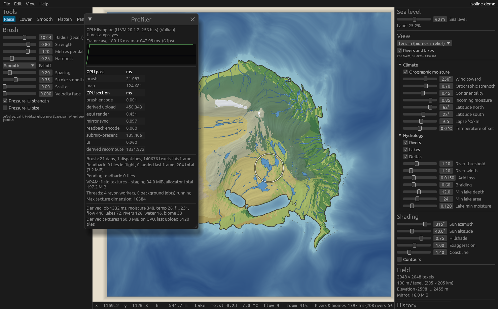

# Isoline

A desktop fantasy map maker where **nothing is tile-based**. Terrain is a set
of continuous scalar fields plus vector geometry, edited by brushes that modify
the underlying data; everything visible (hillshade, the coastline, later rivers,
climate, biomes, forests, settlements) is *derived* from those fields, live.

The coastline is literally the isoline `elevation == seaLevel`, hence the name.



## Status: Milestone 2 — water and biome coupling

Everything below is derived from the elevation field and the map settings,
recomputed on a background thread after every stroke, sea-level change or
settings change, and swapped in when it lands. The UI never blocks; only
tiles whose contents changed are re-uploaded to the GPU.

- **Orographic moisture** (`isoline-core::climate`). Air parcels advect along
  a prevailing wind, recharge over sea, rain at a base rate plus an uplift
  term on windward slopes, and dry in the lee. Implemented as a wind-aligned
  resample so every wind line is a row and rows sweep in parallel. Sliders:
  wind direction, orographic strength, continentality, incoming moisture; a
  disable toggle with a uniform-moisture fallback.
- **Temperature** from a north/south latitude range, lapse rate and offset.
- **Hydrology** (`isoline-core::hydrology`): priority-flood depression fill
  with an epsilon gradient (sea and map border drain), D8 flow directions,
  **precipitation-weighted** flow accumulation with a per-texel arid loss so
  rivers thin and vanish in deserts, lake labelling (min depth, min area,
  and lakes dry up in arid basins), channel tracing into width-carrying
  polylines (trunks own junctions; tributaries record what they join),
  width ∝ √flow with extra width on low slopes (braiding), and distributary
  fans where large rivers meet the sea. Water coverage is rasterized to a
  field the renderer thresholds with screen-space anti-aliasing.
- **Biomes** (`isoline-core::biome`): a Whittaker-style matrix over five
  temperature bins × five moisture bins, editable in the *Biome matrix*
  window (cells, bin edges, alpine slope). Ocean and lakes are forced;
  steep cold ground becomes alpine. A **forest density** field is derived
  from the biome with a treeline fade; the scatter that consumes it comes in
  Milestone 4.
- **View modes**: terrain (biome colour × relief), elevation tint, flat
  biomes, moisture, temperature, flow accumulation; rivers and lakes toggle.
  The status bar reports biome, moisture, temperature and flow under the
  cursor from the CPU mirrors.
- **Project format**: derived parameters live in `manifest.json`; river and
  lake geometry is written to `geometry.json` for other tools. Derived
  fields are recomputed on load, not stored.
- **Graph**: `settings` and `derived` nodes were added with global reach
  from `elevation`, `sea_level` and `settings`. Regional recompute of the
  derived chain is not attempted yet (see deferred).

### Measured (Milestone 2)

Same caveat as Milestone 1: software Vulkan, four CPU cores, no GPU. The
derived chain is CPU work and these numbers are representative of a
four-core machine; a six-core desktop will be roughly proportionally faster.

| Field | Derived chain total | moisture | fill | flow | rivers + water | biome |
|------:|--------------------:|---------:|-----:|-----:|---------------:|------:|
| 2048² | 0.71 s | 0.11 s | 0.22 s | 0.28 s | 0.06 s | 0.01 s |
| 4096² | 3.9 s | 0.55 s | 1.0 s | 1.9 s | 0.19 s | 0.11 s |
| 8192² | 26 s | 3.4 s | 5.5 s | 16 s | 0.57 s | 0.20 s |

At 8192² the serial accumulation walk (67 M cells with random access into
the accumulation array) dominates; that is the pass to parallelise or
restructure by drainage basin next. Full numbers, including the brush and
undo checks that still pass bit-exactly, are in `docs/bench.txt`.

The fill and the accumulation loop are serial by nature (a priority queue
and a topological walk); everything else runs on all cores. The chain
starts 200 ms after the last edit lands and is cancelled and restarted if
another edit arrives, so painting stays at full brush rate and the rivers
follow a beat later.

### Deferred within Milestone 2

- **Regional recompute.** A stroke re-runs the whole chain. The dirty-tile
  machinery is in place; what is missing is a windowed fill/accumulation
  that patches only the affected drainage basins.
- **Parallel depression fill.** Tiled priority-flood with seam correction
  would make the fill scale with cores.
- **Braiding** only widens channels on low slopes; it does not split them
  into anastomosing threads. Deltas are simple radial fans.
- **Erosion** (rivers carving back) is not started; it is the natural next
  step on this chain and will be stored as a re-runnable command per the
  decision above.
- **Derived textures use R32Float** for everything, including the biome id.
  R8 for the biome and R16 for moisture/temperature would cut derived VRAM
  by more than half.

## Milestone 1 — field engine + rendering

Implemented:

- **Elevation field** as an `R32Float` storage texture on the GPU with a
  row-major `f32` CPU mirror. Resolution 512² … 8192² (anything up to the
  adapter's maximum texture size, in multiples of 64).
- **GPU map render**: full-screen pass sampling the live field — hillshade
  (configurable sun azimuth/altitude/strength, vertical exaggeration),
  hypsometric tint, water-depth tint, optional contours, anti-aliased
  **sea-level isoline coastline**, brush cursor ring.
- **Sea level slider** — the coastline moves as you drag; the drag is one undo
  entry.
- **Brushes**: raise, lower, smooth, flatten, through the common pipeline:
  stroke sampling (spacing, exponential smoothing, scatter, pressure and
  velocity dynamics) → falloff kernel (smooth / linear / gaussian / flat,
  hardness) → blend mode (add, subtract, set, min, max, smooth) → compute
  dispatch bounded to the dab rect → dirty tiles → readback → derived update.
- **Dependency graph** with dirty-tile propagation (`isoline-core::graph`).
  Nodes declare their inputs with a *reach* (kernel radius in texels or
  global); dirty sets grow accordingly as they propagate. Milestone 1 nodes:
  `elevation`, `sea_level` → `hillshade`, `coastline` (GPU-live) and `stats`
  (incremental per-tile min/max/land fraction on the CPU).
- **Undo/redo** as sparse per-tile deltas (before/after 64×64 blocks). Entries
  beyond a 512 MiB RAM budget spill to disk and reload on demand.
- **Pan/zoom** (wheel zooms about the cursor; middle/right drag or Space pans;
  Home fits).
- **Project files**: a directory with a diffable `manifest.json` and raw
  little-endian `f32` field blobs, memory-mapped on load. Atomic writes.
  Autosave to a sidecar directory every two minutes with a recovery prompt on
  next open. Native file dialogs.
- **Background jobs** (terrain generation, load, save, autosave) on their own
  threads with rayon inside; the UI never blocks.
- **Profiler overlay** (F3): frame time graph, GPU pass timings via timestamp
  queries, CPU section timings, brush dispatch and readback statistics, VRAM,
  thread counts.
- **Headless benchmark** (`isoline --bench N`) that runs the full brush →
  readback → derived → undo path without a window and checks GPU results
  against the CPU reference kernel bit-for-bit.

### Layout

```
isoline/
  crates/isoline-core   field engine: fields, tiles, graph, brushes, undo, terrain, project I/O,
                        hydrology, climate, biomes, derived chain (no GPU)
  crates/isoline        the application: wgpu pipelines, winit/egui shell, jobs, bench
    src/shaders/brush.wgsl   brush kernel (mirrors isoline-core::brush)
    src/shaders/map.wgsl     map render pass
```

### Building and running

Requires a Rust toolchain (1.88+) and a Vulkan, Metal or DX12 capable GPU
driver.

```
cd isoline
cargo run --release                     # new 2048² continent
cargo run --release -- --size 8192      # bigger field
cargo run --release -- --open My.isoline
cargo run --release -- --bench 4096     # headless benchmark, no window needed
cargo run --release -- --demo --screenshot out.png   # scripted strokes, save, capture, exit
cargo test                              # core unit tests
```

Controls: `1`–`5` tools, `[` `]` brush radius, left-drag paint, middle/right
drag or Space pan, wheel zoom, Home fit, Ctrl+Z / Ctrl+Shift+Z undo/redo,
Ctrl+S / Ctrl+O / Ctrl+N save/open/new, F3 profiler.

### How CPU and GPU stay in sync

The GPU texture is the authority for brush edits. Each dispatch records the
64×64 tiles it touched; each frame those tiles are copied to a mapped staging
buffer (one 256-byte-aligned row per tile row, so no padding) and written into
the CPU mirror when the map completes, normally the next frame. CPU→GPU goes
through tile uploads (undo, redo, project load) and needs no readback because
the mirror already holds the value.

Undo snapshots a tile's pre-stroke contents the first time a stroke touches
it. That read is only valid if the mirror is current, so a stroke start flushes
outstanding readbacks synchronously. The post-stroke contents are captured
once the last readback of that stroke lands. The bench verifies that undoing
two strokes reproduces the original terrain exactly on both CPU and GPU.

### Measured (Milestone 1)

These were measured in a container **without a GPU**: Mesa `llvmpipe`
software Vulkan on 4 CPU cores. They prove the pipeline works and scales to
8192², but they say nothing about the 60 fps target on real hardware, which I
could not measure here. Per-frame numbers are for a batch of 20 dabs whose
radius is 1/32 of the field edge, including the synchronous readback wait
(the app itself never waits; readback lands the next frame).

| Field | Terrain gen (CPU) | Raise: encode+submit+readback / frame | Smooth: same | Derived update / frame | Undo 2 strokes | Full readback |
|------:|------------------:|--------------------------------------:|-------------:|-----------------------:|---------------:|--------------:|
| 2048² |   0.77 s | avg 3.4 ms, max 20 ms | avg 4.8 ms | 0.3 ms | 15 ms (266 tiles) | 27 ms (16 MiB) |
| 4096² |   3.0 s  | avg 10 ms, max 64 ms | avg 16 ms | 0.5 ms | 58 ms (824 tiles) | 115 ms (64 MiB) |
| 8192² |  11.6 s  | avg 76 ms, max 1.8 s* | avg 53 ms | 0.9 ms | 710 ms (2926 tiles) | 371 ms (256 MiB) |

\* first frame: a 64 MiB staging buffer allocation plus pipeline warm-up on
the software driver.

Full numbers, including 4096² and 8192², are in `docs/bench.txt`. GPU/CPU
brush agreement was exact (`max |GPU−CPU| = 0`) at every size, and undo
restored the original field bit-exactly on both sides.

### Deferred within Milestone 1

- **Dockable / detachable panels.** egui windows are movable inside the main
  window; tearing a panel off into its own OS window (egui viewports) and
  per-monitor DPI handling are not done.
- **Pen tilt.** winit 0.30 exposes touch force (mapped to pressure) but no
  tilt on any platform; tilt is plumbed through `StrokeInput` and ignored.
- **Fields larger than one texture.** The interface assumes one texture per
  field; chunking for adapters whose limit is below the chosen size is not
  written (the New dialog hides sizes above the adapter limit).
- **Progressive load.** Field blobs are memory-mapped but copied in full
  before the window shows the map; streaming tiles to the GPU as pages fault
  in is a small follow-up.
- **Mipmapped zoom-out.** When zoomed far out the shader supersamples 4 taps;
  a proper min-filtered pyramid would look better on 8192² fields.
- **Non-multiple-of-64 resolutions** are rejected (row alignment for uploads).

### Decisions taken after Milestone 1

1. World scale (`meters_per_texel`) is presentational only. Elevation stays
   in metres; hydrology and climate work in texels and elevation units.
2. Brush strength keeps the summing model: each dab adds a fixed amount, so
   slower or repeated strokes build higher terrain.
3. Global passes such as erosion will be stored as re-runnable commands
   (seed + parameters), not full-field deltas.
4. Projects stay directories named `Name.isoline`; the single-file bundle is
   an export.

## Roadmap

See the spec: 3 procedural coastline and ridge brushes, 4 assets, 5 naming
and labels, 6 borders and regions, 7 settlement layouts, 8 themes, export,
polish.
