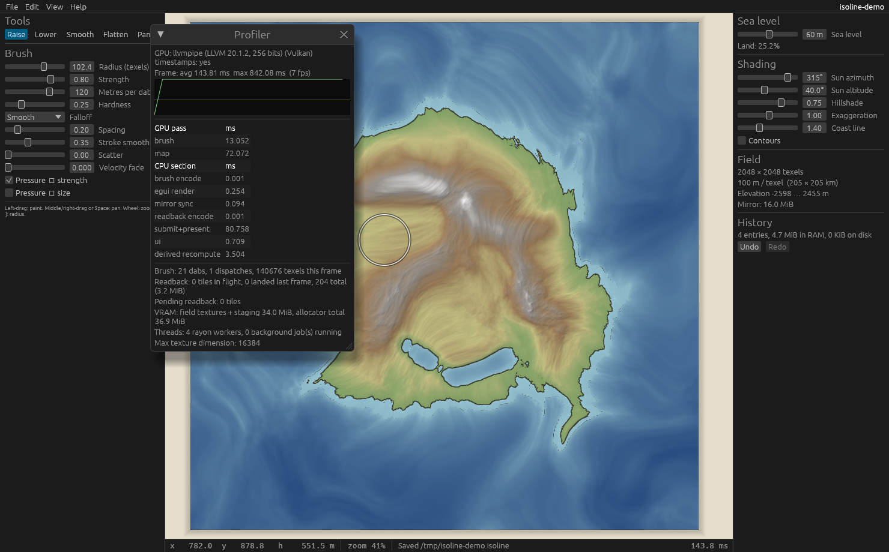

# Isoline

A desktop fantasy map maker where **nothing is tile-based**. Terrain is a set
of continuous scalar fields plus vector geometry, edited by brushes that modify
the underlying data; everything visible (hillshade, the coastline, later rivers,
climate, biomes, forests, settlements) is *derived* from those fields, live.

The coastline is literally the isoline `elevation == seaLevel`, hence the name.



## Status: Milestone 1 — field engine + rendering

Implemented:

- **Elevation field** as an `R32Float` storage texture on the GPU with a
  row-major `f32` CPU mirror. Resolution 512² … 8192² (anything up to the
  adapter's maximum texture size, in multiples of 64).
- **GPU map render**: full-screen pass sampling the live field — hillshade
  (configurable sun azimuth/altitude/strength, vertical exaggeration),
  hypsometric tint, water-depth tint, optional contours, anti-aliased
  **sea-level isoline coastline**, brush cursor ring.
- **Sea level slider** — the coastline moves as you drag; the drag is one undo
  entry.
- **Brushes**: raise, lower, smooth, flatten, through the common pipeline:
  stroke sampling (spacing, exponential smoothing, scatter, pressure and
  velocity dynamics) → falloff kernel (smooth / linear / gaussian / flat,
  hardness) → blend mode (add, subtract, set, min, max, smooth) → compute
  dispatch bounded to the dab rect → dirty tiles → readback → derived update.
- **Dependency graph** with dirty-tile propagation (`isoline-core::graph`).
  Nodes declare their inputs with a *reach* (kernel radius in texels or
  global); dirty sets grow accordingly as they propagate. Milestone 1 nodes:
  `elevation`, `sea_level` → `hillshade`, `coastline` (GPU-live) and `stats`
  (incremental per-tile min/max/land fraction on the CPU).
- **Undo/redo** as sparse per-tile deltas (before/after 64×64 blocks). Entries
  beyond a 512 MiB RAM budget spill to disk and reload on demand.
- **Pan/zoom** (wheel zooms about the cursor; middle/right drag or Space pans;
  Home fits).
- **Project files**: a directory with a diffable `manifest.json` and raw
  little-endian `f32` field blobs, memory-mapped on load. Atomic writes.
  Autosave to a sidecar directory every two minutes with a recovery prompt on
  next open. Native file dialogs.
- **Background jobs** (terrain generation, load, save, autosave) on their own
  threads with rayon inside; the UI never blocks.
- **Profiler overlay** (F3): frame time graph, GPU pass timings via timestamp
  queries, CPU section timings, brush dispatch and readback statistics, VRAM,
  thread counts.
- **Headless benchmark** (`isoline --bench N`) that runs the full brush →
  readback → derived → undo path without a window and checks GPU results
  against the CPU reference kernel bit-for-bit.

### Layout

```
isoline/
  crates/isoline-core   field engine: fields, tiles, graph, brushes, undo, terrain, project I/O (no GPU)
  crates/isoline        the application: wgpu pipelines, winit/egui shell, jobs, bench
    src/shaders/brush.wgsl   brush kernel (mirrors isoline-core::brush)
    src/shaders/map.wgsl     map render pass
```

### Building and running

Requires a Rust toolchain (1.88+) and a Vulkan, Metal or DX12 capable GPU
driver.

```
cd isoline
cargo run --release                     # new 2048² continent
cargo run --release -- --size 8192      # bigger field
cargo run --release -- --open My.isoline
cargo run --release -- --bench 4096     # headless benchmark, no window needed
cargo run --release -- --demo --screenshot out.png   # scripted strokes, save, capture, exit
cargo test                              # core unit tests
```

Controls: `1`–`5` tools, `[` `]` brush radius, left-drag paint, middle/right
drag or Space pan, wheel zoom, Home fit, Ctrl+Z / Ctrl+Shift+Z undo/redo,
Ctrl+S / Ctrl+O / Ctrl+N save/open/new, F3 profiler.

### How CPU and GPU stay in sync

The GPU texture is the authority for brush edits. Each dispatch records the
64×64 tiles it touched; each frame those tiles are copied to a mapped staging
buffer (one 256-byte-aligned row per tile row, so no padding) and written into
the CPU mirror when the map completes, normally the next frame. CPU→GPU goes
through tile uploads (undo, redo, project load) and needs no readback because
the mirror already holds the value.

Undo snapshots a tile's pre-stroke contents the first time a stroke touches
it. That read is only valid if the mirror is current, so a stroke start flushes
outstanding readbacks synchronously. The post-stroke contents are captured
once the last readback of that stroke lands. The bench verifies that undoing
two strokes reproduces the original terrain exactly on both CPU and GPU.

### Measured (Milestone 1)

These were measured in a container **without a GPU**: Mesa `llvmpipe`
software Vulkan on 4 CPU cores. They prove the pipeline works and scales to
8192², but they say nothing about the 60 fps target on real hardware, which I
could not measure here. Per-frame numbers are for a batch of 20 dabs whose
radius is 1/32 of the field edge, including the synchronous readback wait
(the app itself never waits; readback lands the next frame).

| Field | Terrain gen (CPU) | Raise: encode+submit+readback / frame | Smooth: same | Derived update / frame | Full readback |
|------:|------------------:|--------------------------------------:|-------------:|-----------------------:|--------------:|
| 2048² | see `docs/bench.txt` |  |  |  |  |

Full numbers, including 4096² and 8192², are in `docs/bench.txt`. GPU/CPU
brush agreement was exact (`max |GPU−CPU| = 0`) at every size, and undo
restored the original field bit-exactly on both sides.

### Deferred within Milestone 1

- **Dockable / detachable panels.** egui windows are movable inside the main
  window; tearing a panel off into its own OS window (egui viewports) and
  per-monitor DPI handling are not done.
- **Pen tilt.** winit 0.30 exposes touch force (mapped to pressure) but no
  tilt on any platform; tilt is plumbed through `StrokeInput` and ignored.
- **Fields larger than one texture.** The interface assumes one texture per
  field; chunking for adapters whose limit is below the chosen size is not
  written (the New dialog hides sizes above the adapter limit).
- **Progressive load.** Field blobs are memory-mapped but copied in full
  before the window shows the map; streaming tiles to the GPU as pages fault
  in is a small follow-up.
- **Mipmapped zoom-out.** When zoomed far out the shader supersamples 4 taps;
  a proper min-filtered pyramid would look better on 8192² fields.
- **Non-multiple-of-64 resolutions** are rejected (row alignment for uploads).

### Decisions I need

1. **Elevation units and world scale.** Fields are in metres with a per-project
   `meters_per_texel` (default 100 m, so 2048² ≈ 205 km across). Hydrology and
   orographic moisture in Milestone 2 depend on this. Keep metres, or make the
   world scale purely presentational?
2. **Brush strength semantics.** Raise/lower apply `strength × metres-per-dab`
   per dab. An alternative is a fixed stroke height independent of spacing and
   speed (accumulate a max instead of summing dabs). Which feels right to you?
3. **Undo of global operations.** Sea level is stored as a value delta. When
   erosion arrives, a full-field before/after at 8192² is 512 MiB per entry.
   I plan to store such passes as a re-runnable command (seed + parameters)
   rather than a delta. Confirm?
4. **Project file extension.** Currently a directory named `Name.isoline`.
   Fine, or would you rather have the single-file bundle be the default and
   the directory the "unpacked" form?

## Roadmap

See the spec: 2 water and biome coupling, 3 procedural coastline and ridge
brushes, 4 assets, 5 naming and labels, 6 borders and regions, 7 settlement
layouts, 8 themes, export, polish.
